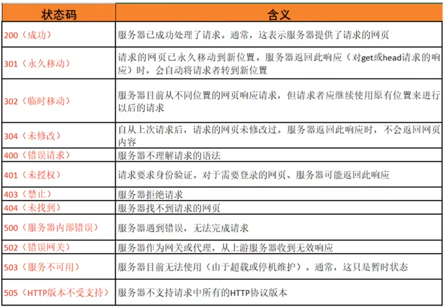

## 1. 概念
接口测试属于功能测试和灰盒测试

1. 接口测试一般是在单元测试之后进行测试。
2. 每个阶段都进行接口测试，并辅助测试工作。

## 2. 接口分类
- **内部接口**：公司开发做的事情；接口可以分为：上层服务、下层服务和同级接口
- **外部接口**：第三方接口。如购物平台-支付:支付宝支付、微信支付、银行卡支付。

## 3.通讯协议原理理解
URL（统一资源定位符）= 协议 + 域名（IP）+ 地址 + 参数：https://www.baidu.com
   1. https: 协议
   2. www.baidu.com：域名
   3. /s :地址
   4. ?: 后面跟的都为参数

### 3.1 TCP/IP协议

### 3.2 HTTP协议
1. 请求
   - 请求行：请求方法 + 请求路径（URL）
   - 请求头：一般由开发/服务器定义，数据无法更改
   - 请求体
2. 请求方法： GET, POST, HEAD, OPTIONS、PUT、PATCH、DELETE、TRACE 和 CONNECT 
3. POST和GET的区别
   1. POST请求的参数一般不会放在URL中，而是在请求体中，GET请求的参数一般放在URL中，而是在请求体中
   2. POST请求体数据放在body中所以不会有长度限制
   3. GET请求的安全性比POST安全性低
   4. GET 从服务器获取数据， POST是向服务器传输数据
   
4. 响应
   - 状态行
     - HTTP 版本
     - 状态码： 200 404 500
     - 状态消息
   - 响应头
   - 响应正文
5. 状态码的定义
   | 分类 | 分类描述                                     |
   | ---- | -------------------------------------------- |
   | 1xx  | 信息，服务器收到请求，需要请求者继续执行操作 |
   | 2xx  | 成功，操作被成功接受并处理                   |
   | 3xx  | 从定向，需要进一步操作以完成请求             |
   | 4xx  | 客户端错误，请求包含语法错误或无法完成请求   |
   | 5xx  | 服务器错误，服务器在请求过程中发生错误       |

    
    
### 3.3 HTTPS协议