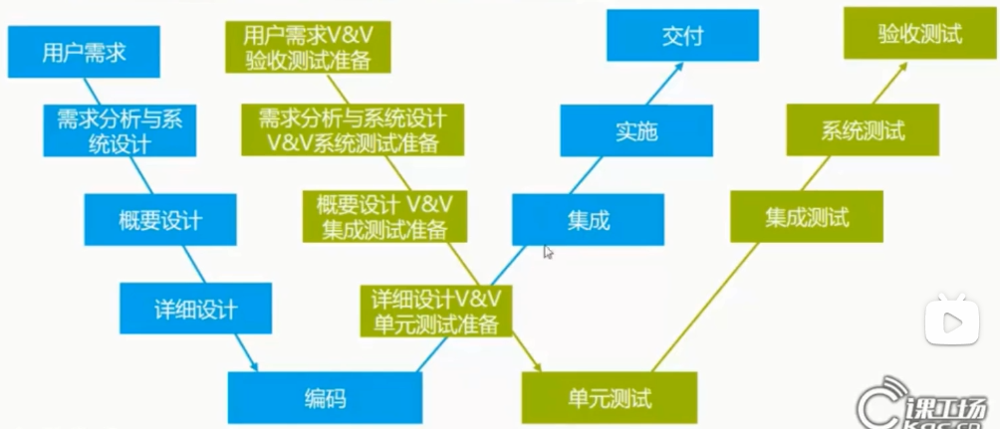
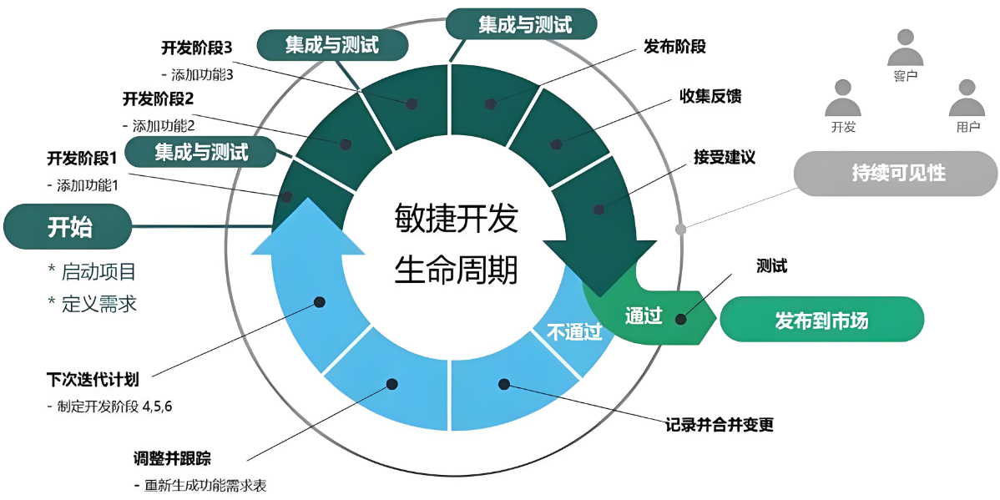
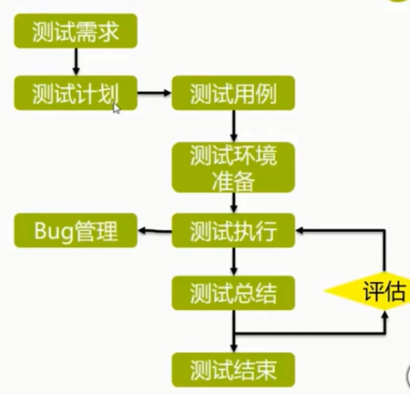

# 1. 软件开发模型
## 1.1 瀑布式模型
将软件生命周期划分为以下6个阶段，并自上而下依次进行。
- 指定计划
- 需求分析
- 软件设计
- 程序编写
- 软件测试
- 运行维护

## 1.2 W模型(双V模型)
体现 “尽早和不断进行软件测试”的原则

## 1.3 敏捷开发模型
是一种以用户的需求进化为核心、迭代、循序渐进的开发方法

# 2. 软件测试流程
- **测试需求**
- **测试计划**：生成测试计划文档并评审
  - 前言: 目的 | 名词解释 | 参考资料 | 测试摘要
  - 资源需求：硬件资源 | 软件资源 | 人力资源
  - 测试描述：测试范围 | 测试目标 | 风险和约束 | 测试进度
  - 测试策略：整体策略 | 测试类型 | 测试技术
  - 测试提交文档
  - 质量目标
  - 计划审核记录
- **测试用例**：根据产品需求进行编写并通过评审
- **测试环境准备**：准备软硬件环境，分配相应资源的权限，有环境验证记录
- **测试执行**
- **测试总结**
  - 引言
  - 测试概要： 测试环境 | 测试项目 | 测试时间 | 测试人员 
  - 测试结果： 安装升级卸载测试 | 功能测试 | 缺陷 | 用例执行情况
  - 测试结论
- **测试评估**
- **Bug管理**
