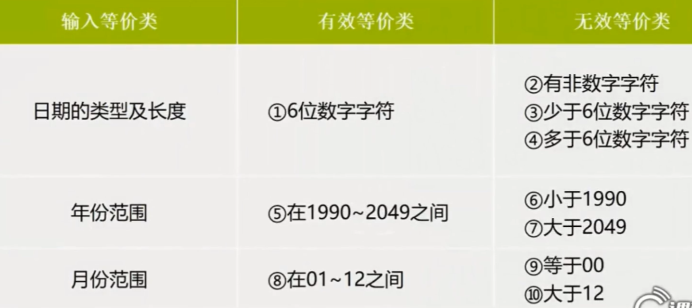
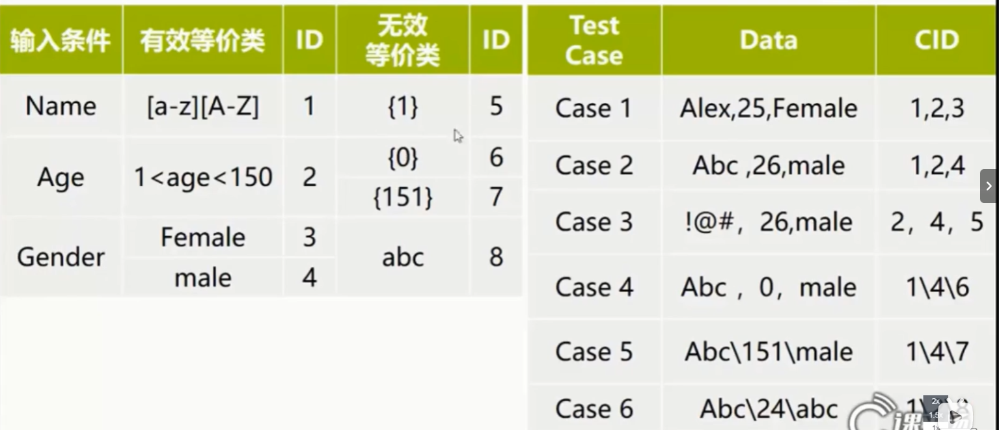
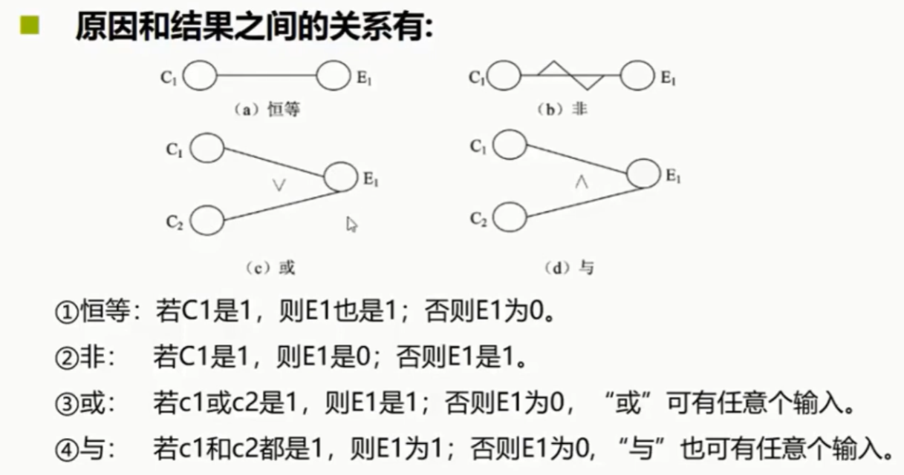
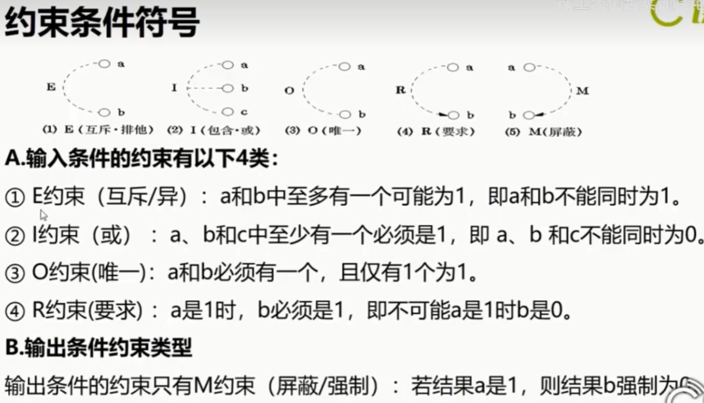

## 1. 等价类划分
### 1.1 概念
等价类划分就是把所有的输入数据/输入域划分为若干部分，从每一部分中选取少量有**代表性**的数据作为测试用例，代表性数据等同于该类中的其他值。

### 1.2 分类

- 有效等价类：对于程序规格来说是合理/有意义的输入数据构成的合集
- 无效等价类：对于程序规格来说是不合理/无意义的输入数据构成的合集

### 1.3 作用域
输入数据、输出数据

### 1.4 划分方法

划分为互不相交的一组子集，而子集不是整个集合

- 按区间划分
- 按数值划分
- 按数值集划分
- 按现在条件划分
- 按处理方式划分

| 类型  | 测试要点 | 有效等价类 | 无效等价类 |
|-------|-------|-------|-------|
| 数值  |...输入值范围可以从1-999...| 1<= x <= 999 | x < 1 或 x > 999 |
| 条件  | 以字母打头的字符串 | 所有以字母打头的字符串 | 不以字母打头的字符串 |
| 数值 | ...是否已婚... | {Ture, False} | {非布尔值} |
| 数值集 | ...对x,y,z分别计算... | {x, y, z} | {非x,y,z} |

### 1.5 使用等价类编写测试用例
1. 列出测试要点的定价类表格
2. 设计一个新的测试用例，使其尽可能多地覆盖尚未覆盖的**有效等价类**，重复直到覆盖所有有效等价类
3. 使用单独的一个测试覆盖一个单独的**无效等价类**，重复直到覆盖所有无效等价类

### 1.5 案例分析

## 2.边界值分析
### 2.1 概念
对输入或输出的边界值进行测试的一种黑河测试方法，稍微高于其边界值及稍微低于其边界值的一些特定情况

### 2.2 分类

- 刚好等于边界值
- 刚刚大于边界值
- 刚刚小于边界值

| 类型  | 测试要点 | 边界值|
|-------|-------|-------|
| 数值  |...输入值范围可以从1-9...| 1, 9, 0.9, 9.1 |
| 个数  |...输入个数在1-9之间...| 0, 1, 9, 10|
| 数值 | ...是否已婚... | {Ture, False} |
| 数值集 | ...对x,y,z分别计算... | {x, y, z} |

## 3.因果图分析法
### 3.1 概念
从程序规格说明书的描述中找出**因**（输入条件）和**果**（输出或程序状态的改变）通过因果图转换为判定表，最后为判定表中的每一列设计一个测试用例。

### 3.2 适用范围
适用于不同条件组合对应不同的结果状态，根据不同组合的情况输出不同的测试用例

### 3.3 分析方法和步骤

1. 分析软件规格说明的描述中哪些是原因，哪些是结果。
   
   - 原因是输入或者输入条件的等价类，结果是输出条件
   - 给每个原因和结果富裕一个标识符，根据这些关系画出因果图
2. 因果图上用一些记号表面约束条件或限制条件
3. 对需求加以分析并把他们表示为因果图之间的关系图。
4. 把因果图转换成判定表。
5. 将判定表的每一列作为依据，设计测试用例。

## 4.场景法
### 4.1 概念
现在的软件几乎都是用事件触发来控制流程的，事件触发时的情景便形成了**场景**，而同一事件不同的触发顺序和处理结果就形成了**事件流**

通过运用场景来对系统的功能点或业务流程的描述，从而提高测试效果的一种方法

### 4.2 原理
- **基本流**：采用直黑线表示，是经过用例的最简单的路径（无任何差错，程序从开始直接执行到结束）
  
- **备选流**： 采用不同颜色表示，一个备选流可能从基本流开始，在某个特定的条件下执行，然后重新加入基本流中，也可以起源于另个一备选流，或终止用例不再加入基本流中。

### 4.3 分析方法和步骤
1. 根据说明，描述处程序的基本流以及各项备选流
2. 根据基本流和备选流生成不同的场景
3. 对每个场景生成相应的测试用例
4. 对生成的所有测试用例重新审查，去除掉多余的测试用例，测试用例确定后，对每个测试用例确定测试数据值。