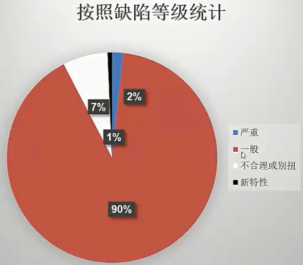

## 1.  测试总结报告的意义
- 软件测试人员对整个系统测试工作进行总结
- 测试领导了解被测试产品的质量情况软
- 件开发经理了解项目过程中的问题
- 对外发布产品的重要参考依据

## 2.  测试总结报告的分类
- 按照测试里程碑分
  - 单元测谴总结报告 | 集成测谴总结报告 | 系统测谴总结报告
- 按照测试类型分
  - 功能测总结报告 | 性能测总结报告 | 安全性测谴总结报告
- 按照工作周期分
  - 测试日报 | 测试周报 | 测试完成确认报告

## 2. 测试总结报告的内容
1. 简介
2. 测试背景
   1. 项目背景
   2. 测试环境
3. 测试计划进度执行情况
   1. 测试人员安排
   2. 测试时间
   3. 测试版本信息
4. 测试执行阶段情况报告
   1. 测试用例分布情况
   2. 测试用例执行情况
5. 缺陷的统计与分折
   1. 测试结果汇总
   2. 测试缺陷状态分布
   3. 测试结果分析
   4. 重要缺陷摘要
   5. 残留缺陷与未解决问题
6. 测试结论与建议
   1. 测试结论
   2. 建议

## 2. 测试结果及缺陷分析
1. 测试需求覆盖情况： 
   列出需求功能项、功能项的用例数量、用例覆盖情况等
   

2. 测试过程统计
   - 每轮未处理的缺陷个数统计
   - 每轮新提交的缺陷个数统计
    
    

3. 测试结果统计
   - 按照缺陷的严重性统计
    
   - 按照缺陷所属的功能模块统计
    
   - 按照开发人员的回复意见
    
   - 按照bug修复率统计
    
